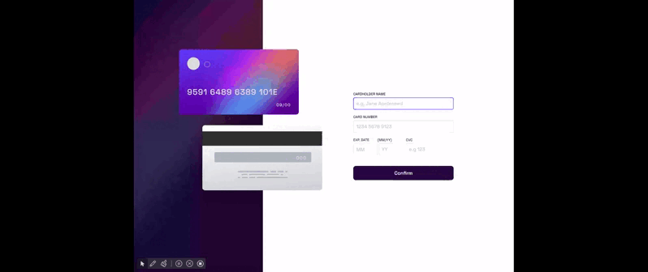
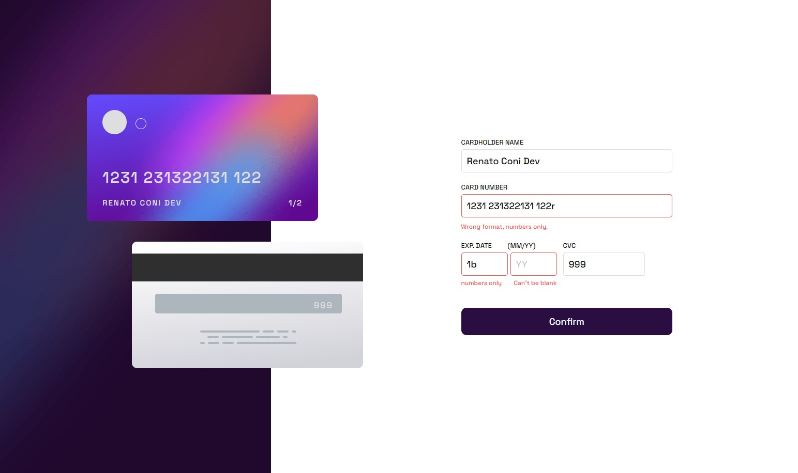

# Frontend Mentor - Interactive card details form solution

This is a solution to the [Interactive card details form challenge on Frontend Mentor](https://www.frontendmentor.io/challenges/interactive-card-details-form-XpS8cKZDWw). Frontend Mentor challenges help you improve your coding skills by building realistic projects. 

## Table of contents

  - [Overview](#overview)
  - [The challenge](#the-challenge)
  - [Screenshot](#screenshot)
  - [Links](#links)
  - [My process](#my-process)
  - [Built with](#built-with)
  - [Continued development](#continued-development)
  - [Author](#author)

**Note: Delete this note and update the table of contents based on what sections you keep.**

## Overview

form design with interactive card, checking inputs and interaction with page decorative elements.

### The challenge

Users should be able to:

- Fill in the form and see the card details update in real-time
- Receive error messages when the form is submitted if:
  - Any input field is empty
  - The card number, expiry date, or CVC fields are in the wrong format
- View the optimal layout depending on their device's screen size
- See hover, active, and focus states for interactive elements on the page

### Screenshot

### Links

- Solution URL: [https://github.com/renatoconi/portfolio/tree/master/FRONTEND%20MENTOR%20interactive-card-details-form-main](https://your-solution-url.com)
- Live Site URL: [https://renatoconi.github.io/portfolio/FRONTEND%20MENTOR%20interactive-card-details-form-main/]

## My process
running the second solution to get to know the Mentor frontend site better

### Built with

- Semantic HTML5 markup
- CSS custom properties
- Flexbox

### Continued development

I will continue to practice, so that I can develop codes with speed and quality.

## Author

- Renato Coni

- Website - (https://renatoconi.github.io/portfolio/my%20website/)
- Frontend Mentor - [@renatoconi](https://www.frontendmentor.io/profile/@renatoconi)
- [Linkedin](https://www.linkedin.com/in/renato-coni-aa6636196/).
