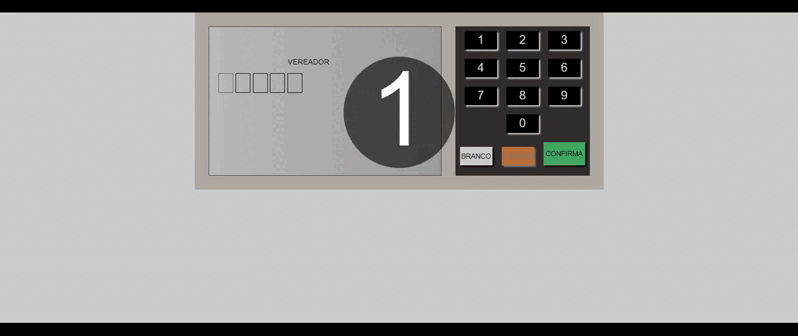

- Live Site URL: [https://renatoconi.github.io/portfolio/URNA%20ELETRONICA/]

# Eletronic Urna

This was an academic project, with the aim of fixing learnings in the Html,CSS and Javascript course.

## Index

- [Overview](#Overview)
- [Screenshot](#screenshot)
- [My process](#my-process)
- [Built with](#built-with)
- [Author](#author)

## Overview
Another academic project: a website with responsive design, another step towards becoming a quality developer.

## My process
Continuously training html and css to develop with speed and quality.
### Built with
- Semantic HTML5 markup
- Custom CSS properties
- Flexbox
## Author
- Renato Coni
- [My Site](https://renatoconi.github.io/portfolio/my%20website/)
- [Linkedin](https://www.linkedin.com/in/renato-coni-aa6636196/)