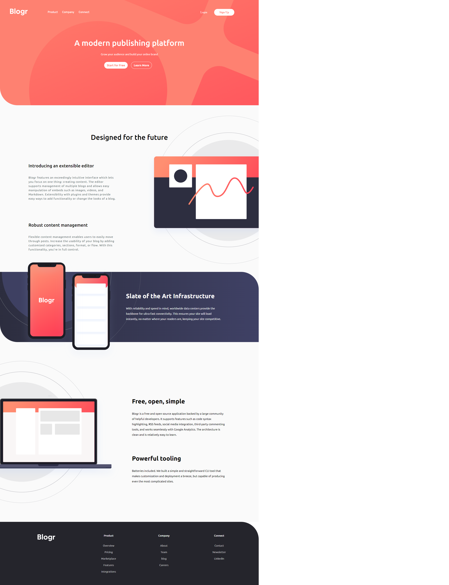
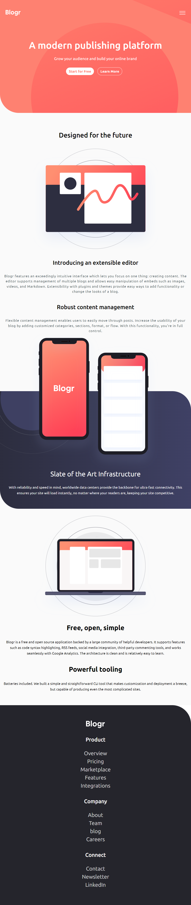
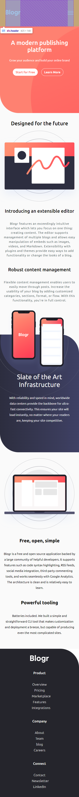

# Frontend Mentor - Blogr landing page solution

This is a solution to the [Blogr landing page challenge on Frontend Mentor](https://www.frontendmentor.io/challenges/blogr-landing-page-EX2RLAApP). Frontend Mentor challenges help you improve your coding skills by building realistic projects. 

## Table of contents

- [Overview](#overview)
  - [The challenge](#the-challenge)
  - [Screenshot](#screenshot)
  - [Links](#links)
- [My process](#my-process)
  - [Built with](#built-with)
- [Author](#author)

**Note: Delete this note and update the table of contents based on what sections you keep.**

## Overview
Another portfolio project: a website with responsive design, another step towards becoming a quality developer.

### The challenge

Users should be able to:

- View the optimal layout for the site depending on their device's screen size
- See hover states for all interactive elements on the page

### Screenshot

Resposive 1440px example.

Resposive 768px example.

Resposive 768px example.

### Links

- Solution URL: [https://github.com/renatoconi/portfolio/tree/master/blogr-landing-page-main]
- Live Site URL: [https://renatoconi.github.io/portfolio/blogr-landing-page-main/]

## My process
I keep training html, css and javascript to develop with speed and quality.
### Built with
- Semantic HTML5 markup
- CSS custom properties
- Flexbox
## Author
- Frontend Mentor - [@renatoconi](https://www.frontendmentor.io/profile/renatoconi).

