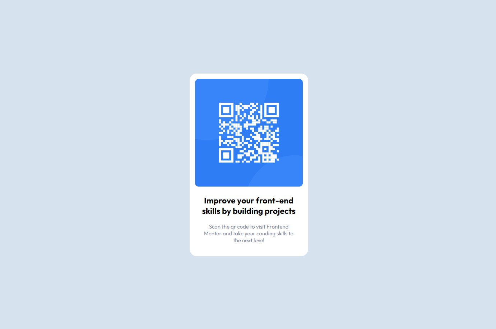

# Frontend Mentor - QR code component solution

This is a solution to the [QR code component challenge on Frontend Mentor](https://www.frontendmentor.io/challenges/qr-code-component-iux_sIO_H). Frontend Mentor challenges help you improve your coding skills by building realistic projects. 

## Table of contents

  - [Overview](#overview)
  - [Screenshot](#screenshot)
  - [Links](#links)
  - [My process](#my-process)
  - [Built with](#built-with)
  - [What I learned](#what-i-learned)
  - [Continued development](#continued-development)
  - [Author](#author)

## Overview
Static page design for QR code reading.
### Screenshot

### Links

- Solution URL: [Add solution URL here](https://your-solution-url.com)
- Live Site URL: [Add live site URL here](https://your-live-site-url.com)

## My process
running the first solution to get to know the Mentor frontend site better
### Built with

- Semantic HTML5 markup
- CSS custom properties
- Flexbox

### Continued development

I will continue to practice, so that I can develop codes with speed and quality.

## Author

- Website - [Renato Coni](https://www.your-site.com)
- Frontend Mentor - [@renatoconi](https://www.frontendmentor.io/profile/yourusername)

